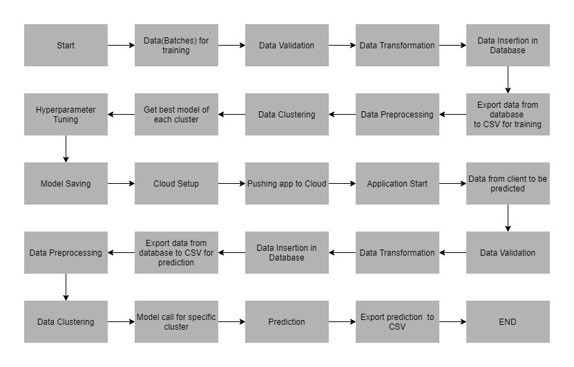

## Badges

Add badges from somewhere like: [shields.io](https://shields.io/)

[](https://www.python.org/downloads/release/python-360/)

[](https://shields.io/)
# Credit Card Default Prediction using Machine Learning

classification methodology to determine whether a person defaults the credit card payment for the next month. 

### Description
In this project NaiveBayes and XGBoost is applied on data which clustered using kmeans clustering inorder to find best fit model for each cluster in oder to predict defaults in  payment 


## Architecture

 


Data Ingestion---Involves following steps

                1.Validating Data against predecided format
                2.Data transformation for database insertion
                3.Data insertion into Database

Model Training---Involves following steps

                1.Data preprocessing
                2.Clustering the Data
                3.Getting best model for each cluster
                4.Hyperparameter tunning
                5.Saving model
prediction or test data is subjected to steps in data ingestion and model training
                


## Flask Application  


## Data description

Data is organized in to multiple sets of files in batches at a given location. The data has been extracted from the census bureau. 
The data contains 32561 instances with the following attributes:
Features:

1.	LIMIT_BAL: continuous.Credit Limit of the person.
2.	SEX: Categorical: 1 = male; 2 = female
3.	EDUCATION: Categorical: 1 = graduate school; 2 = university; 3 = high school; 4 = others
4.	MARRIAGE: 1 = married; 2 = single; 3 = others
5.	AGE-num: continuous. 
6.	PAY_0 to PAY_6: History of past payment. We tracked the past monthly payment records (from April to September, 2005)
7.	BILL_AMT1 to BILL_AMT6: Amount of bill statements.
8.	PAY_AMT1 to PAY_AMT6: Amount of previous payments. 


Target Label:
Whether a person shall default in the credit card payment or not.
9.	default payment next month:  Yes = 1, No = 0

## Exploratory Data Analysis

[EDA](EDA/creditCardFraudEDA.ipynb)

# How run it?

### STEPS:
Clone the Repository

```bash
  https://github.com/Naveen0821/creditcard_frauddetection.git
```
### STEP 01- Create a conda environment after opening the repository

```bash
  conda create -n creditcard_frauddetection python=3.6 -y

```
```bash
  conda activate creditcard_frauddetection

```
### STEP 02- install the requirements
```bash
  pip install -r requirements.txt

```
```bash
  python main.py

```
once application is up and running we have routes for training and prediction.After running training , prediction is made for all the clusters, the predictions along with the names are saved in a CSV file at a given location, and the location is returned to the client.


